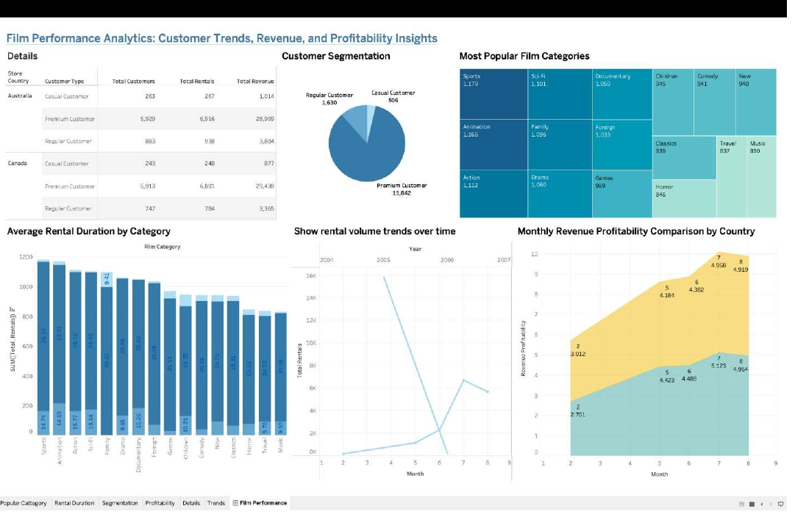
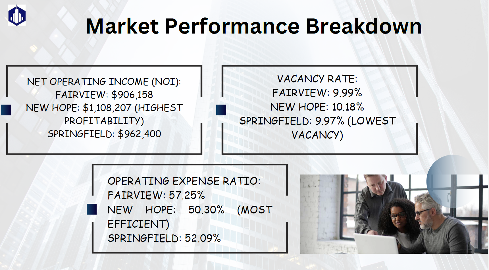
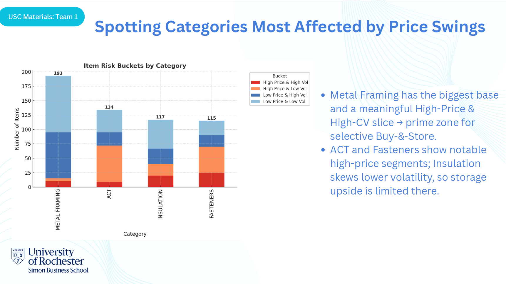
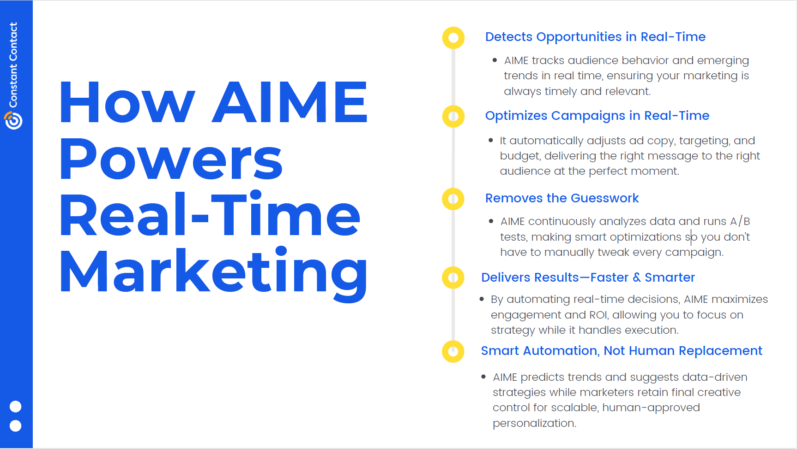
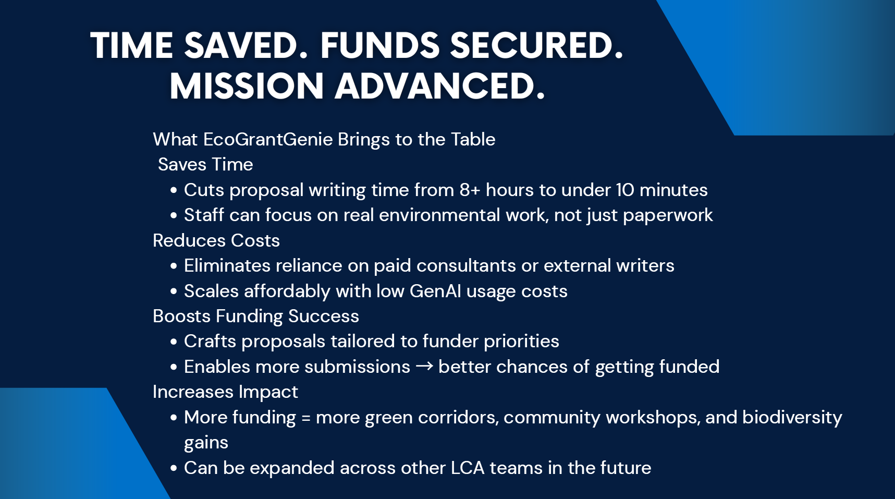

<h1 align="center">Priyanka Yadav</h1>

<p align="center">
Business Analytics • Marketing Analytics • Data Visualization
</p>

<p align="center">
SQL | Tableau | Python | Business Intelligence
</p>

<p align="center">
<a href="mailto:Priyankayadav01238@gmail.com">📧 Email</a> |
<a href="https://www.linkedin.com/in/yadav27/">🔗 LinkedIn</a>
</p>

<p align="center">
Welcome to my analytics portfolio where I showcase projects focused on data-driven business insights.
</p>

<hr>

---

## About Me

I’m a Business Analytics graduate with experience analyzing business, marketing, and operational data using SQL, Tableau, and statistical analysis.

My projects focus on transforming raw data into insights that improve decision-making, from customer lifetime value analysis to market investment evaluation and marketing optimization.

I’m currently pursuing roles in Business Analytics and Marketing Analytics.

## Tools & Technologies


---

## Projects

🎬 Film Rental SQL + Tableau Analytics

### Problem
A film rental company wanted to understand customer rental behavior, revenue trends, and the performance of different film categories across locations.

### My Approach
I designed SQL queries to combine multiple tables including rentals, payments, films, and customers. Using this dataset, I built Tableau dashboards to analyze revenue trends, category popularity, and customer behavior.

### Example SQL Query – Customer Lifetime Value Analysis

This query calculates Customer Lifetime Value (CLV) by identifying the customers who generated the highest revenue through rentals.

```sql
SELECT 
    c.customer_id,
    CONCAT(c.first_name, ' ', c.last_name) AS customer_name,
    COUNT(r.rental_id) AS total_rentals,
    SUM(p.amount) AS total_spent
FROM customer c
JOIN rental r ON c.customer_id = r.customer_id
JOIN payment p ON r.rental_id = p.rental_id
GROUP BY c.customer_id, customer_name
ORDER BY total_spent DESC
LIMIT 10;
```
### Insight Generated
This analysis helped identify the highest value customers based on their rental activity and total spending.
The results show that a small group of repeat customers generated a significant share of total revenue.

### Tools
SQL | Tableau | Data Visualization

### Key Insights
• Sports and Animation were the most rented film categories  
• A small segment of repeat customers generated a significant share of revenue  
• Rental demand varied significantly by location



🔎[View Full Project](Film_Rental_SQL_Tableau_Analytics.pdf)

<br>
<br>

🏙 Real Estate Market Selection & Investment Optimization

### Problem
An investment firm wanted to determine which city offered the best opportunity for a new real estate development project.

### My Approach
I analyzed multiple real estate markets by comparing NOI, vacancy rates, operating costs, and potential equity growth. Financial modeling and simulation were used to evaluate risk and return across markets.

### Tools
Financial Modeling | Market Analysis | Python | Excel

### Key Insight
New Hope emerged as the strongest investment opportunity due to its higher projected NOI and stronger long-term equity growth.



🔎[View Full Project](Real_Estate_Market_Selection_and_Investment_Optimization.pdf)

<br>
<br>

🏗 Construction Cost Operations Analytics

### Problem
Construction material prices can fluctuate significantly, creating cost risks for large projects.

### My Approach
I analyzed procurement and pricing data to identify categories most affected by price volatility and vendor concentration risks.

### Tools
Operations Analytics | Cost Analysis

### Key Insight
A small number of material categories showed significant price swings, highlighting opportunities for better procurement strategies.



🔎[View Full Project](Construction_Cost_Operations_Analytics.pdf)

<br>
<br>

🤖⚡ AI Marketing Campaign Optimization Strategy

### Problem
Marketing teams often struggle to quickly identify which campaigns are performing well and how to adjust strategies in real time.

### My Approach
I designed a conceptual AI-driven marketing engine that monitors campaign performance, identifies emerging trends, and automatically recommends optimizations such as A/B testing and budget allocation.

### Tools
Marketing Analytics | AI Strategy | Campaign Optimization

### Key Insight
An automated system that analyzes campaign data in real time can significantly improve marketing efficiency and help teams respond faster to performance trends.



🔎[View Full Project](AI_Marketing_Campaign_Optimization_Strategy.pdf)

<br>
<br>

🌱 EcoGrantGenie – AI Grant Writing Assistant

### Problem
Nonprofit organizations spend significant time writing grant proposals, often with limited resources and tight deadlines.

### My Approach
I developed the concept for an AI-powered system that assists nonprofits by analyzing grant requirements and generating structured proposal drafts using natural language processing.

### Tools
AI Product Design | NLP | LLM Prompt Engineering

### Key Insight
Automating parts of the grant-writing process can dramatically reduce preparation time while helping organizations focus on refining strategy and storytelling.



🔎[View Full Project](EcoGrantGenie_AI_Grant_Writing_Assistant.pdf)

<br>
<br>
<hr>

<p align="center">
Built by Priyanka Yadav • Business & Marketing Analytics Portfolio
</p>

<p align="center">
© 2026
</p>
